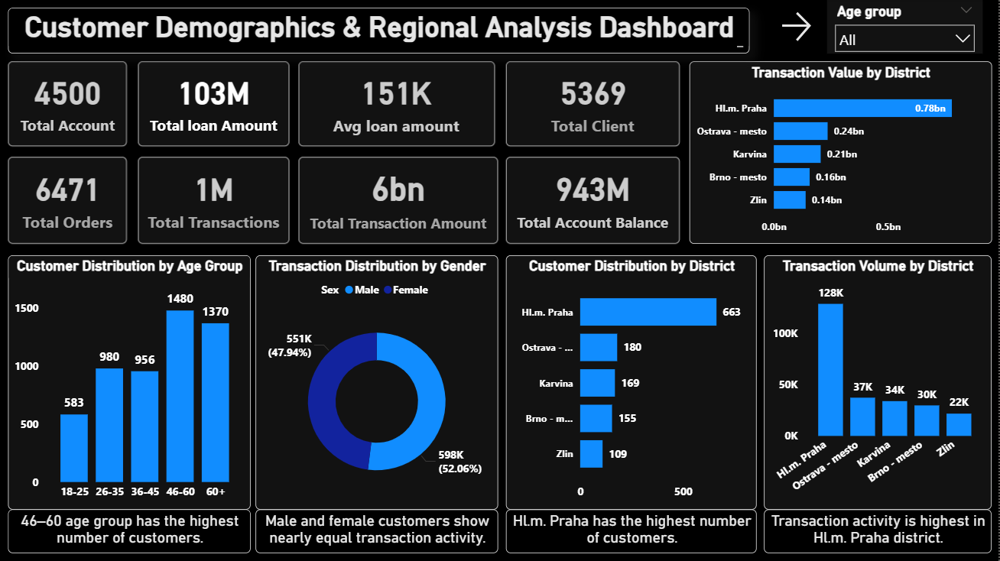
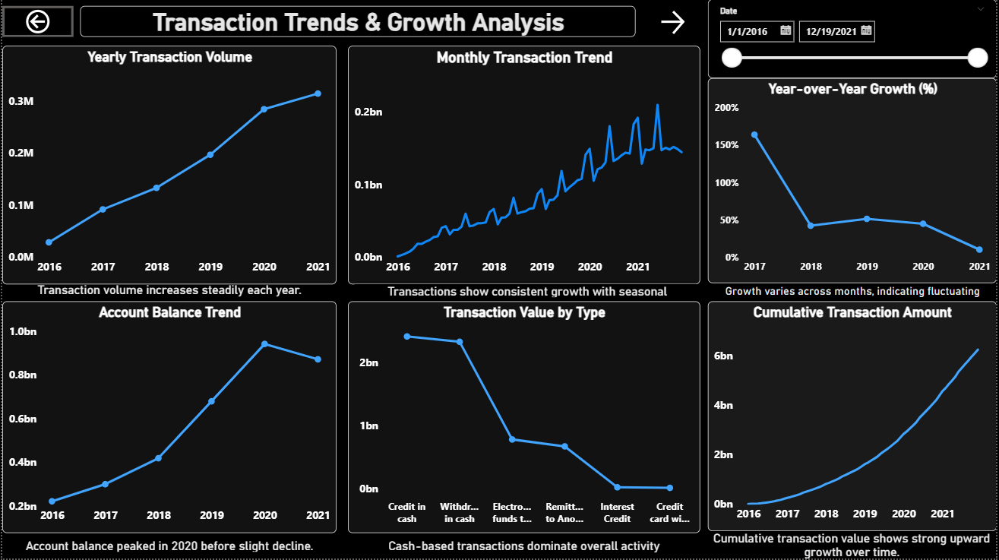
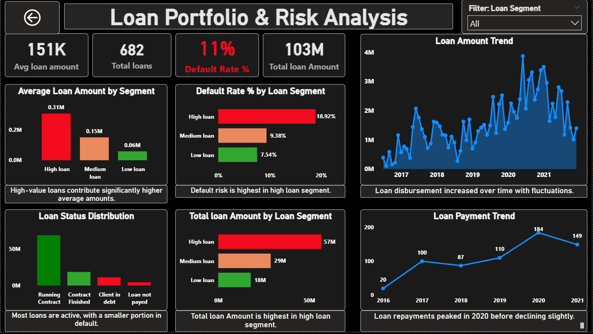
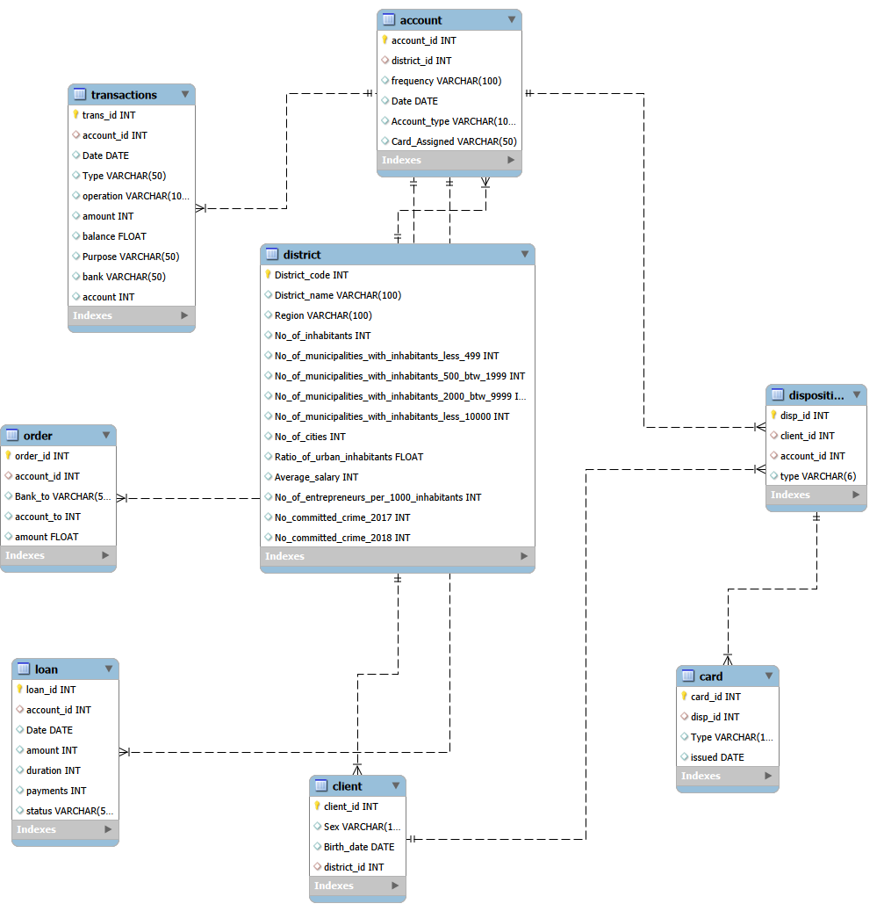

# 📊 Banking Data Analysis Dashboard

**End-to-end Banking Data Analysis using Excel, SQL, and Power BI**

---

## 🚀 Problem Statement
Analyze banking data to understand **customer behavior, transaction trends, and loan risk**.  
Provide insights to improve **profitability and decision-making**.

---

## ⚙️ Approach
- Data Cleaning: Excel  
- Database & Analysis: MySQL (SQL)  
- Data Modeling: ER Diagram  
- Visualization: Power BI (DAX)

---

## 📈 Key Insights
- High-value loans have the **highest default risk**
- Transaction activity is highest in **Prague district**
- **Cash withdrawals dominate** transactions
- Transactions show **steady yearly growth**

---

## 🛠️ Tech Stack
Excel | MySQL | Power BI | DAX

---

## 📸 Dashboard Preview

### Customer Dashboard

### Transaction Dashboard

### Loan Dashboard

### ER Diagram

